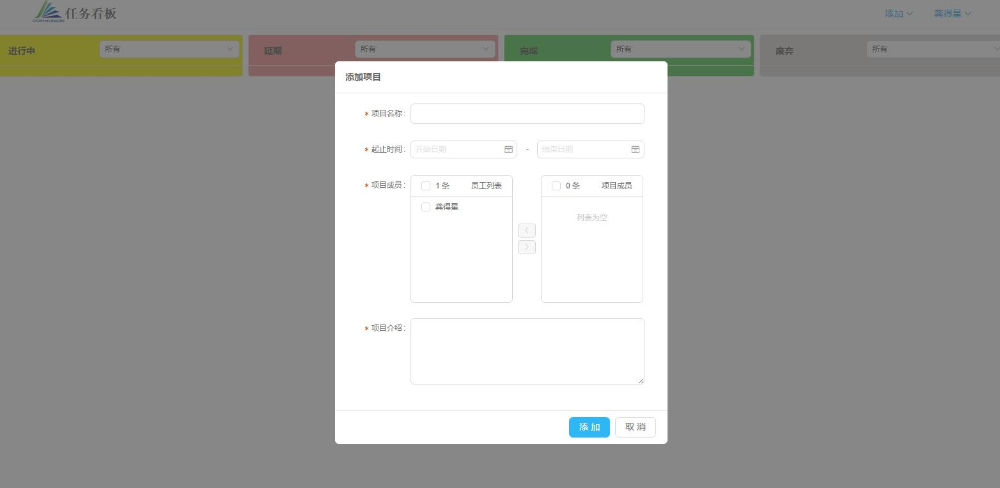

# 任务板
简单、灵活的任务管理应用，聚焦在任务管理，所有任务一目了然，非常合适中小团队

## 运行
> 安装mysql数据库

> git clone git@github.com:GongDexing/work-board.git

> cd work-board

> mysql -uroot -p

> source /path/to/project/work_board.sql

> quit

> npm install

> webpack

> 修改email.js邮箱配置

> npm start

## 使用
### 注册
如果人不多的话，可以由管理员统一进行注册，然后个人根据自己设置密码即可
> 姓名: 员工的姓名(可以是中文)

> 邮箱：填写工作邮箱

### 登录

### 添加项目

点击右上角添加菜单，选择添加项目

### 添加任务
添加任务同添加项目一样，但是有几点需要注意
- 任务必须要选择归属项目
- 归属项目一旦选择，任务负责人必须是项目成员，起止时间必须在项目周期内

### 任务操作

任务的创建人和负责人可以对于处于进行中和延期两种状态的任务可以进行 **完成**,**延期**,**指派**,**废弃** 四种操作，并且每种操作都有触发邮件系统，会自动将操作消息发送给任务相关人员，

#### 完成任务
完成必须填写完成说明,任务被完成后，任务就好在完成栏中显示

#### 延期任务
延期任务必须填写延期说明和延期日期，延期日期必须大于未延期前的结束任务，小于项目截至日期

#### 废弃任务
废弃任务必须填写废弃说明

#### 指派任务
指派任务必须填写指派负责人和指派说明，不去指派负责人不能和当前负责人相同

### 任务筛选
在右上角有筛选条件的选择框，可以基于项目或者负责人对任务进行刷选，为了保证灵活性，每种状态的刷选条件都是相互独立的

### 设置
设置窗口中可以修改手机号和登录密码

